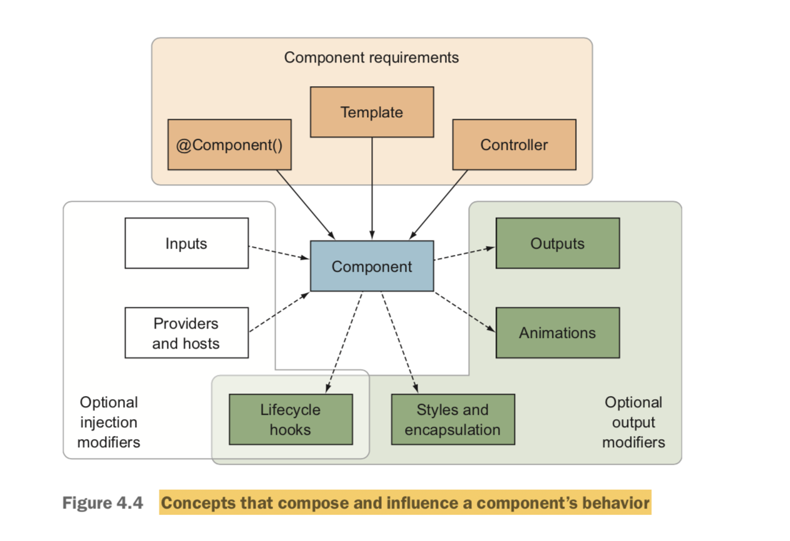
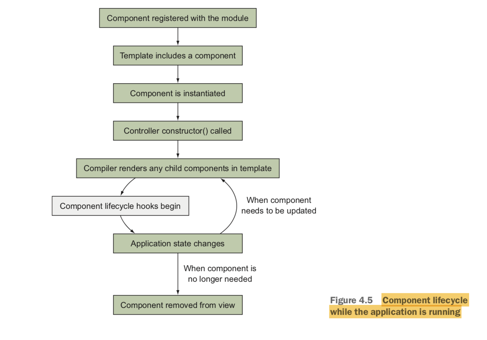

# Component basics

## I. Composition of a component



### 1. Component metadata decorator @Component()*

### 2. Controller*

### 3. Template*

### 4. Input

### 5. Output

### 6. Styles and encapsulation

### 7. Animations

### 8. Lifecycle hooks

### 9. Providers and hosts

Services can be injected directly into component if they're not already provided at the root level module.

## II. Component lifecycle & lifecycle hooks



### 1. Component lifecycle

#### a. Component registered with the module -->

There is a registry of components that belong to the module.

#### b. Template includes a component -->

#### c. Component is instantiated -->

Metadata is read.

#### d. Controller constructor() called -->

Child components are not available at this time yet.

#### e. Compiler renders any child components in template <-->

Component lifecycle hooks begin. Child components rendering won't stop the component from continue to render.

#### f. Application state changes -->

Components will be updated.

#### g. When component is no longer needed, component removed from the view

### 2. Lifecycle hooks

#### a. ngOnChanges(changes: SimpleChanges)

Respond when Angular (re)sets data-bound input properties. The method receives a SimpleChanges object of current and previous property values.
Called before ngOnInit() and whenever one or more data-bound input properties change.

#####  Notes

ngOnChanges only runs when a component have at least 1 input and the inputs is set from the template.

ngOnChanges only runs when the Input change comes from a template binding like `<component [someInput]="aValue">`. If you set it manually like this `component.someInput = aValue`, that happens outside the change detection cycle and you need to let Angular know somehow that you’ve changed something.

ngOnChanges lifecycle hook is triggered on a child component before the child view is checked and it will be triggered even if changed detection for the child view will be skipped. 

##### With `<component [someInput]="aValue">` and changeDetection: ChangeDetectionStrategy.OnPush

When the whole inputs changed (new value on primitive types, or new object reference):
```
ngOnChanges get called
ngDoCheck get called
ngAfterContentChecked get called
ngAfterViewChecked get called
```

When part of an input changed (reference to an input has not changed, when we change the value of a property of an object):
```
ngDoCheck get called
ngAfterContentChecked get called
ngAfterViewChecked get called
```

#### b. ngOnInit()

This run once after the components has fully initialized (though not necessarily when all child components are ready), which is after the first ngOnChanges hook.

#### c. ngDoCheck()

Detect and act upon changes that Angular can't or won't detect on its own.
Called during every change detection run, immediately after ngOnChanges() and ngOnInit().

#### d. ngAfterContentInit()

Respond after Angular projects external content into the component's view / the view that a directive is in.
Called once after the first ngDoCheck().

#### e. ngAfterContentChecked()

Respond after Angular checks the content projected into the directive/component. You can implement additional change detection logic here.
Called after the ngAfterContentInit() and every subsequent ngDoCheck().

#### f. ngAfterViewInit()

Respond after Angular initializes the component's views and child views / the view that a directive is in. This lets you know when the whole component tree has fully initialzed and can be manipulated.
Called once after the first ngAfterContentChecked().

#### g. ngAfterViewChecked()

Respond after Angular checks the component's views and child views / the view that a directive is in. You can implement additional logic to determine whether changes occurred here.
Called after the ngAfterViewInit() and every subsequent ngAfterContentChecked().

#### h. ngOnDestroy()

Before the component is completely removed.
Called just before Angular destroys the directive/component.

## III. Nesting components

There are two ways to nest components:

- Any component that's nested inside another's template is called View Child. A View Child is declared inside the component template.
- A component accepts content to be inserted into its template is call Content Child:

```html
<!--UserProfile component-->
<user-avatar [avatar]="avatar"></user-avatar>
<ng-content></ng-content>
```

```html
<!--When using UserProfile component-->
<user-profile [avatar]="user.avatar">
    <user-details [user]="user"></user-details>
</user-profile>
```

## IV. Types of components

### 1. App component

The root app component, and you only get one of these per application.

Recommended guidelines for App component:

- Keep it simple
- Use for application layout scaffolding
- Avoid loading data

### 2. Display component

A stateless component that reflects the values passed into it, making it highly reusable.

Recommended guidelines for Display component:

- Decouple
- Make it only as flexible as necessary
- Don't load data, accepts inputs only (need to verify inputs at runtime)
- Have a clean API
- Optionally use a service for configuration

### 3. Data component

A component that helps get data into application by loading it from external resources.

Recommended guidelines for Data component:

- Use appropriate lifecycle hooks
- Don't worry about reusability
- Set up display components
- Isolate business logic inside

### 4. Route component

When using the router, each route will render a component, and this makes the component intrinsically linked to the route.

Recommended guidelines for Route component:

- Template scaffolding for the route
- Load data or rely on data components
- Handles route parameters

## V. Content projection

Content projection allows us to declare the place to insert external content into our component.

We can use component selectors as `[app-nodes]` (contains table headers) and `[app-nodes-row]` (contains table colums for a single row):

```typescript
// table.component.ts
@Component({
  selector: '[app-table]',
  templateUrl: './table.component.html',
})
export class TableComponent {}
```

```html
<!--table.component.html-->
<thead>
    <th>ID</th>
    <th>Name</th>
    <th>Nation</th>
</thead>
<ng-content></ng-content>
```

```typescript
// table-row.component.ts
@Component({
  selector: '[app-table-row]',
  templateUrl: './table-row.component.html',
})
export class TableRowComponent {
  @Input() item: any
}

```

```html
<!--table-row.component.html-->
<td>{{item?.id}}</td>
<td>{{item?.name}}</td>
<td>{{item?.nation}}</td>
```

```html
<!--dashboard.html-->
...
<table app-table>
    <tr app-table-row *ngFor="let item of data" [item]="item"></tr>
</table>
...
```

We can use multiple NgContent elements by adding an attribute that has a CSS to use for targeting.

```typescript
@Component({
  selector: 'app-name-card',
  templateUrl: './name-card.component.html',
})
export class NameCardComponent {}
```

```html
<!--name-card.component.html-->
Name: <ng-content select="name"></ng-content>
<br>
Position: <ng-content select="position"></ng-content>
<br>
...
```

```html
<!--demo.component.html-->
<app-name-card>
    <name>Nhan Nguyen</name>
    <position>Leader</position>
</app-name-card>
```
*Note: You need to add `schemas: [NO_ERRORS_SCHEMA]` to the module defination.
