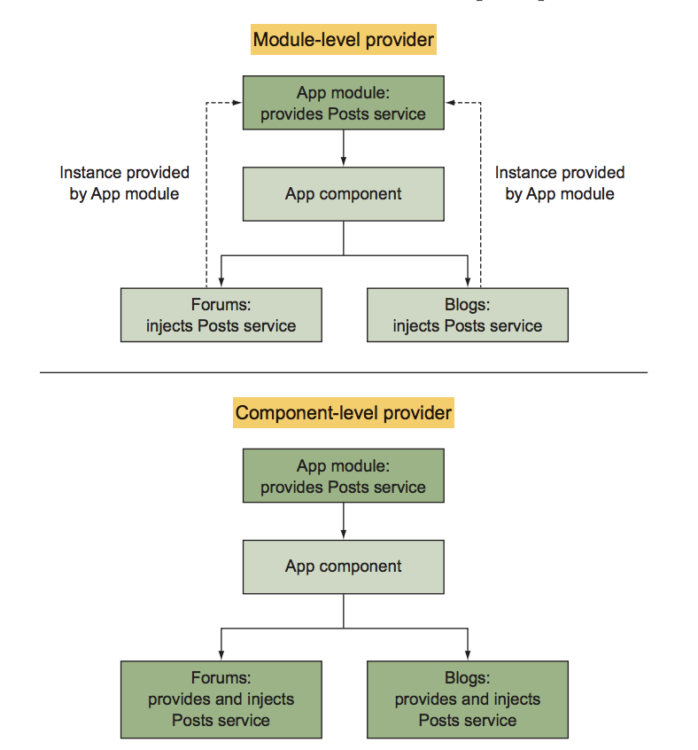
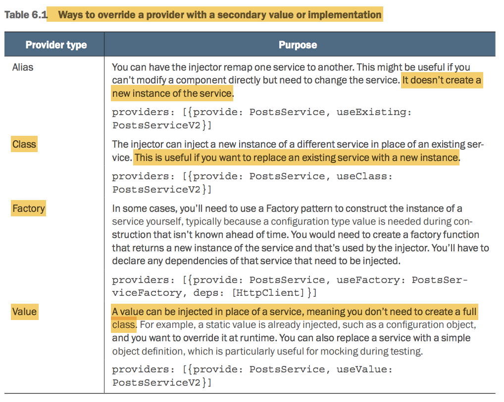

# Services

## I. Service types

* Injectable services: provide feature for the application and work with Angular's DI system to be injected into component
* Non-injectable services: Javascript that aren't tied into Angular's DI system and are just imported into the file
* Helper services: services that make it easier to use a component or feature. For example, a service to help manage the currently active alert on the page
* Data services: services for sharing data across the application. For example, an object holding data for the logged-in user.

## II. Setup injectable services to work with Angular's DI system

*Injectable* decorator is used to wire the class to work with Angular's DI system

For a service to be injectable, we need to register it in the providers array of an appropriate module.

Inject service in to a component

## III. Injector tree



Ways to override a provider



## IV. Declare Interceptor

``` typescript
providers: [
    {
        provide: HTTP_INTERCEPTORS,
        useClass: StocksInterceptor,
        multi: true
    }
]
```

## V. Additional services

Angular exposes many entities in the API that is injectable and you can inject in your application, such as a Location service for managing URLs, Currency pipe, ...