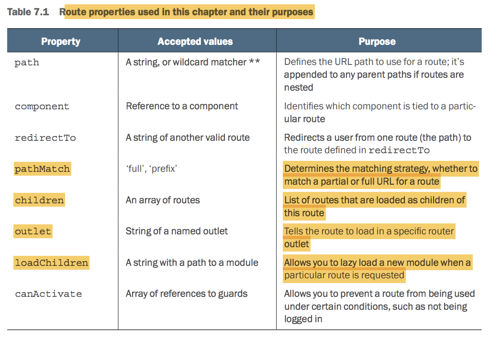
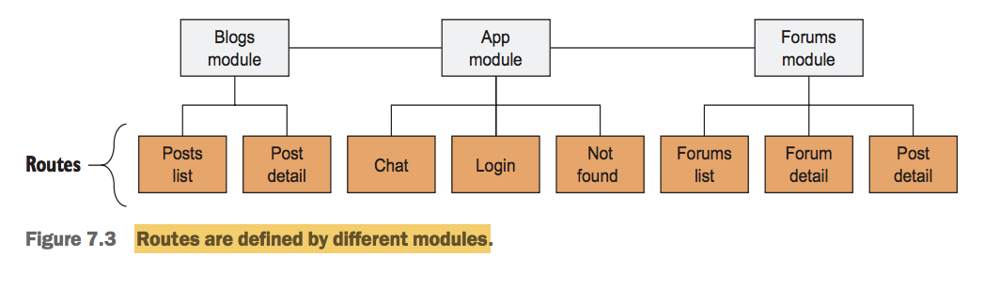

# Routing

## I. Route properties



## II. Define routes



Use `RouterModule.forRoot` in `AppModule`, and use `RouterModule.forChild` in imported modules

## III. Route parameters

` { path: 'forums/:forum_alias', component: ForumComponent }`

**Create links in template with `routerLink`**

```html
<a class="nav-link" routerLink="/forums"><span class="nav-text">Forums</span></a>
<a class="nav-link" routerLink="['/forums']"><span class="nav-text">Forums</span></a>
```

**Accessing the route parameters in a component**

Use `ActivatedRoute` and `Router`

Observable subscriptions in Routing don't need to unsubscribe

We can access infomation of parent route

## IV. Child routes

```typescript
const forumsRoutes: Routes = [
    { path: 'forums', component: ForumsComponent },
    {
        path: 'forums/:forum_alias',
        component: ForumComponent,
        children: [
            { path: '', component: ThreadsComponent },
            { path: ':thread_alias', component: ThreadComponent }
        ]
    }
];
```

## V. Secondary routes

In desktop applications, email applications (such as Outlook or Apple Mail) often will
open a new window for composing a new email, and the user can flip between the
windows to continue their work. Gmail has a feature that allows you to create a new
email in a little window inside the application while you continue to navigate around
the rest of the application—which is the same concept as a secondary route. Secondary
routes are designed to allow the user to draft an email while continuing to use the email
application. 

**Define a secondary route**

This outlet has a name attribute to allow us to target loading
routes into this outlet instead of the primary outlet:

```html
<router-outlet name="chat"></router-outlet>
```

```typescript
const appRoutes: Routes = [
    { path: 'login', component: LoginComponent },
    { path: 'users', component: ChatListComponent, outlet: 'chat', },
    { path: 'users/:username', component: ChatComponent, outlet: 'chat', },
    { path: '', redirectTo: '/forums', pathMatch: 'full' },
    { path: '**', component: NotFoundComponent },
];
```

```html
<a class="nav-link nav-icon" [routerLink]="[{outlets: { chat: ['users']}}]">
    <clr-icon shape="talk-bubbles"></clr-icon>
</a>
```

Once you’re rendering a component inside of a secondary route, you still link different routes together using the same rules. You don’t have to specify the outlet as long as
you use relative links. The context of the route will be understood by the router, so this
will help simplify your links.

You can change the primary route from a secondary route as long as you provide an
absolute path (such as /forums). Using an absolute path from a secondary route will
change the primary outlet, but the secondary route will remain at the same route.

We then want to navigate to a relative path with this username, because we defined the secondary route to be /users/:username. Add the bolded routerLink to the link:

```html
<a class="btn btn-sm btn-link btn-primary" *ngIf="talkTo"
[routerLink]="[talkTo]">Start Chat with {{talkTo}}</a>
```

To close a secondary route, you set the current route to null and that will remove it.

```typescript
close() {
 this.router.navigate([{outlets: {chat: null}}]);
}
```

## VI. Route guards

Five types of guards and their basic roles:

- **CanActivate** — Used to determine whether the route can be activated (such as user validation)
- **CanActivateChild** — Same as CanActivate, but specifically for child routes
- **CanDeactivate** — Used to determine whether the current route can be deactivated (such as preventing leaving an unsaved form without confirmation)
- **CanLoad** — Used to determine whether the user can navigate to a lazy loaded module prior to loading it
- **Resolve** — Used to access route data and pass data to the component’s list of providers


**Injectable, need to declare in providers array**

## VII. Lazy loading

```typescript
const appRoutes: Routes = [
    { path: 'login', component: LoginComponent },
    { path: 'users', component: ChatListComponent, outlet: 'chat', canActivate:
    [ AuthGuardService ] },
    { path: 'users/:username', component: ChatComponent, outlet: 'chat',
    canActivate: [ AuthGuardService ] },
    { path: 'blogs', loadChildren: 'app/blogs/blogs.module#BlogsModule' },
    { path: '', redirectTo: '/forums', pathMatch: 'full' },
    { path: '**', component: NotFoundComponent },
];
```
