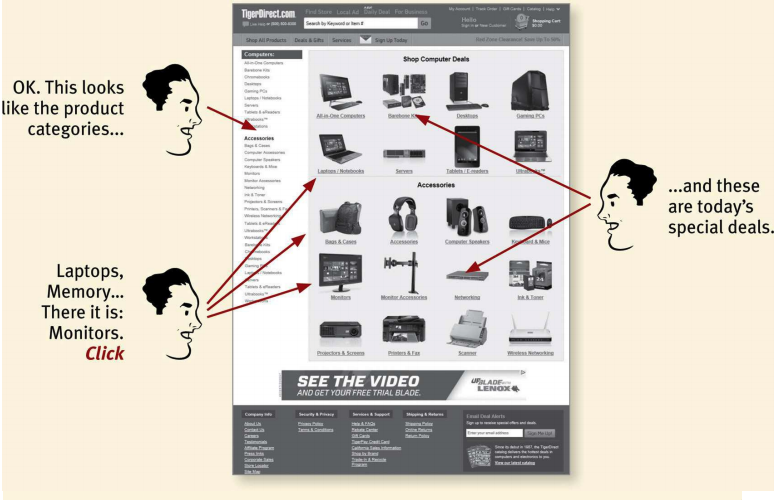
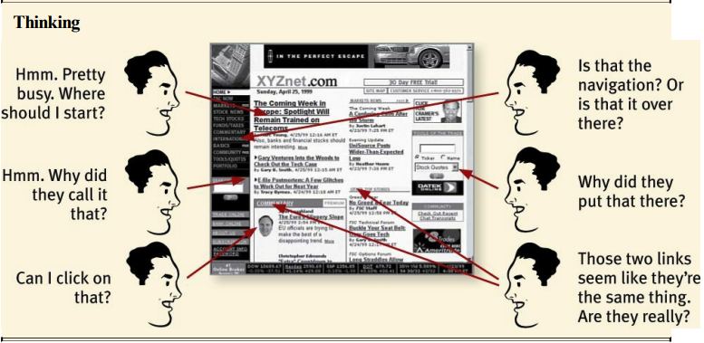
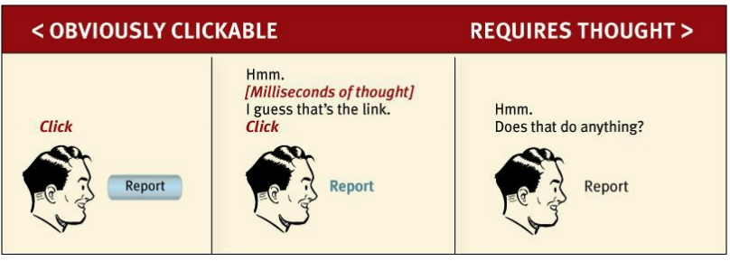
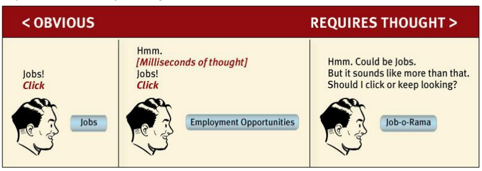
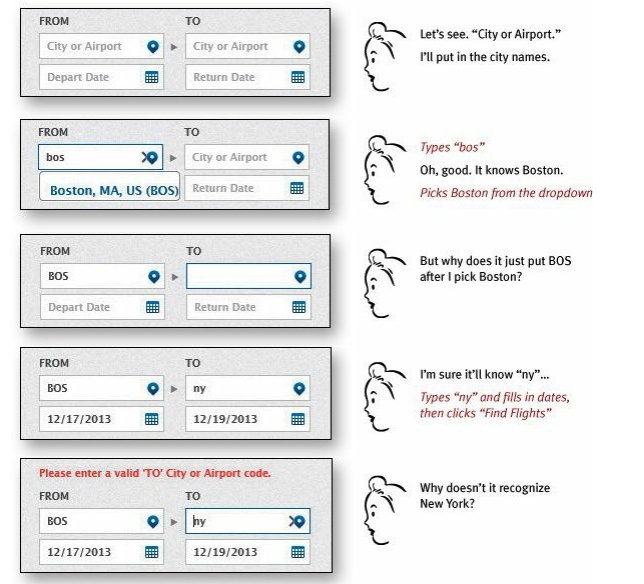
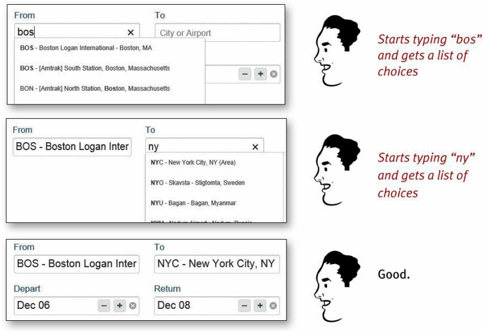

# Part A - Guidin Principles

# Chap 1 - Don't make me think

## I. How to make your website or app easy to use

Most important rule: **Don't make me think**

User thoughts when look at your app should be:

**Ok, there's the ___. And that's a ___. And there is the thing that I want.**

What don't make me think

What make me think

**When you creating a site or app, your job is get rid of the question marks**

Things that make us think:

List of things that users shouldn't spend their time thinking about:

- where am I?
- where should I begin?
- where did they put ___?
- what are the most important things on this page/app?
- why did they call it that?
- is that an ad or part of the site?
- ...
