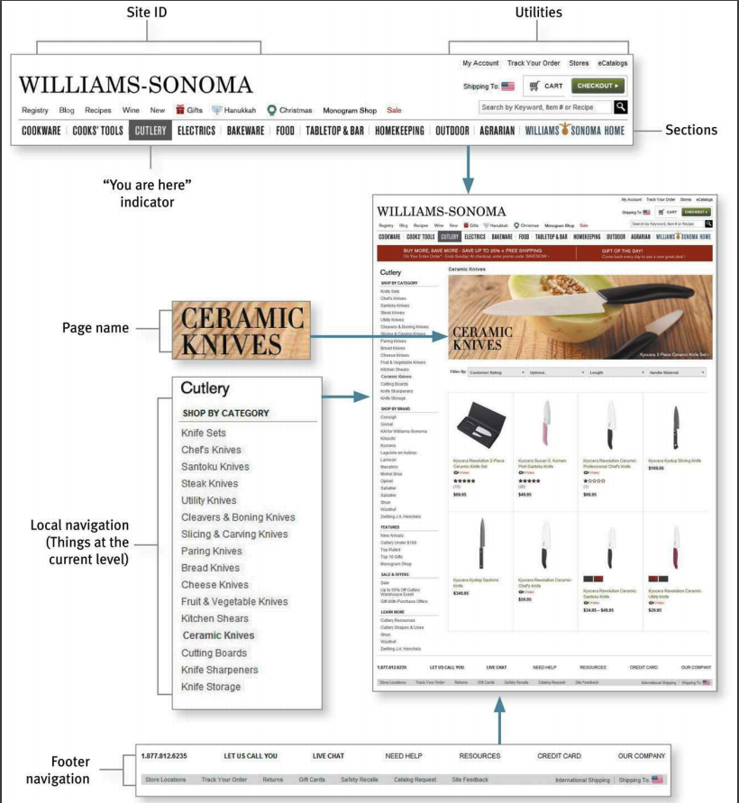
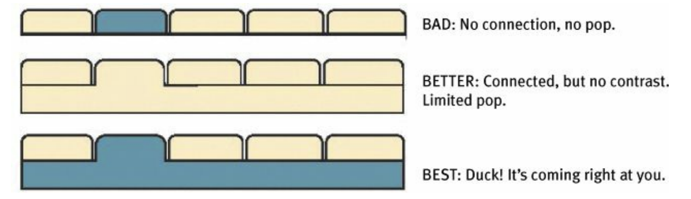

# Part B - Things You Need To Get Right

# Chap 6 - Street signs and Breadcrumbs

## I. Process When you enter a web site

- You're usually trying to find something
- You decide whether to ask first or browse first
    - If you choose to browse, you make your way through a hierachy, using signs to guide you
    - Eventually, if you can't find what you're looking for, you'll leave

## II. The oddities of Web space

- No sense of how big the site is
- No sense of direction
- No sense of location

## III. Purposes of navigation

- It tells us what's there
- It tells us how to use the site
- It gives us confident in the people who built it

## IV. Web navigation conventions

### 1. Site ID

Help users recognize they are still in your site or in other site

### 2. The Sections

Navigate through page's hierachy

Should indicate where the user currently in

**Site level** must be defined as soon as posible

**Home button** => way to go home whenever you get lost

### 3. The Utilities

Elements that are not really part of the site hierachy (search, signin, about us, ...)

**For search**: AVOID **fancy words, instructions, options**

### 4. Page names

- Every page need a page name (NOT highlight in the navigation)
- The name needs to be in the right place (should appear to be framing the content unique to this page)
- The name should be prominent (this is the heading of the entire page)
- The name should be match what I clicked

### 5. Breadcrumbs

Show where you are, Like "you are here" indicators.

Make it easier to move back up to higher levels

Best practices:

- Put them at the top
- Use > between levels
- Boldface the last item

### 6. Tabs

- They are self-evident
- They are hard to miss
- They are slick

### 7. Test your site

Any page of your site should show these infomation clearly:

- What site is this? (Site ID)
- What page am I on? (Page name)
- What are the major sections of this site? (Sections)
- What are my options at this level? (Local navigation)
- Where am I in the scheme of things? ("You are here" indicator)
- How can I search?
