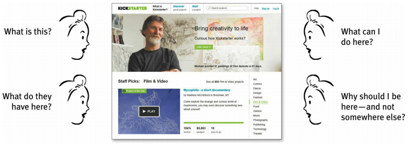

# Chap 7 - The Big bang theory of web design

## I. Home page

Home page need to answer 5 questions

And "Where do I start?"

Don't try to promote everything

## II. How to get the message across

- The tagline
- The welcome blurb
- The "learn more"

## III. Where do I start?

User after enter Home page should be able to say with confidence:

- Here's where to start if I want to search
- Here's where to start if I want to browse
- Here's where to start if I want to sample their best stuff