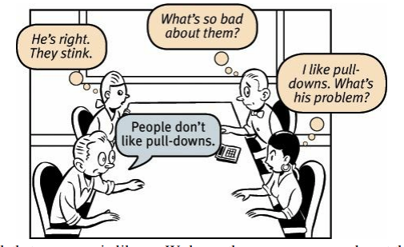
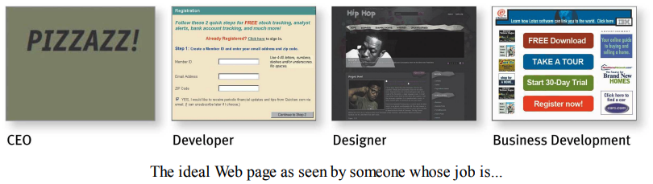

# Part C - Make sure you got them right

# Chap 8 - "The Farmer and the Cowman Should Be Friends"

People are different, but we usually think they all like the same things like us

The point is, it’s **not productive** to ask questions like *“Do most people like pull-down menus?”* The **right kind of question to ask** is *“Does this pull-down, with these items and this wording in this context on this page create a good experience for most people who are likely to use this site?”* 

There is only one way to answer: **testing**