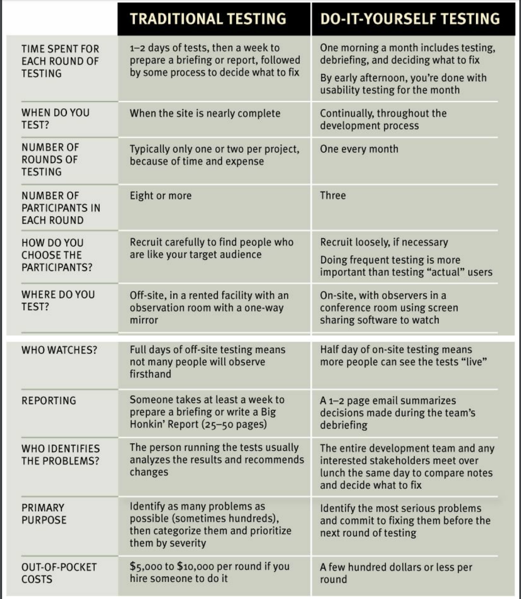

# Chap 9 - Usability testing on 10 cents a day

## I. Focus groups are not usability testing

**Focus group**

- A small group of people (5-10) sit around a table and talk about things, like their opinions about the products, their past experiences with them, or their reactiosn to new concepts.
- Good for quickly getting a sampling of users' feelings and opinions about things, determin what your audience wants, needs, and like
- Should be used before designing or building anything

**Usability tests**

- About only watching one person at a time try to use something (whether it's a website, a prototype, or some sketches of new design) to do typical tasks
- Good for learning about whether your site works and how to improve it
- Should be used through the entire process

## II. Serveral true things about usability testing

- If you want a great site, you've got to test
- Testing one user is 100% better than testing none
- Testing one user early in the project is 50% better than testing near the end

## III. Do-it-yourself usability testing

- Step 1: Determine what you are going to test
- Step 2: Decide what you should test first
- Step 3: Ask or hire a test participant
- Step 4: Create a task (for example, purchase car insurance from our website)
- Step 5: Create a scenario (a brief description which helps your test participant in completing your task, for example, *you are a person who needs to renew their car insurance. Determine how much insurance you need, compare car insurance quotes and then make a purchase. Here are your account and credit card details: ...*)
- Step 6: Deliver instructions to your test participant
    - Request your test participant to speak their thoughts and actions as they browse the website
    - Request that they do not to ask any questions about the website should be used during the test.
- Step 7: Ask questions from the test participant when they look confused, puzzled or frustrated but do not help them
- Step 8: Record the screen activities of your test participant
- Step 9: Take notes throughout the test
- Step 10: Draw conclutions from your usability test

More detail at [here](https://www.optimizesmart.com/pocket-guide-to-usability-testing)
